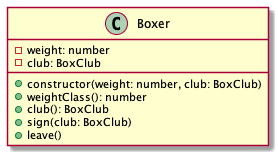
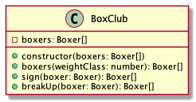

# Boxing

Modellezzünk egy boksz klubot! Legyen egy BoxClub és egy Boxer osztály.

# Boxer

A Boxer egy bokszolót ír le. A bokszoló lényeges tulajdonságai a súlya és a klub, ahol szerződése van. Egy bokszolónak egyszerre egy klubnál lehet szerződése.

A bokszoló a súlya alapján lehet könnyű-, közép-, és nehézsúlyú. 

A súlycsoportokat számok jelölik:
- 1: könnyű (48-60)
- 2: közép (61-90)
- 3: nehéz (91-)

A súly most csak egész szám legyen. A súlycsoportok intervallumai zártak,
azaz 48 kg és 60 kg is könnyűsúly.

## constructor(weight: number, club: BoxClub)

Inicializálja a propertyket.

Ha a weight nincs megadva IllegalState hibát dob.

- `should throw IllegalState when weight is missing`

Ha a weight kisebb, mint 48 kg RangeError hibát dob.

- `should throw RangeError when weight is lower than lightweight lower bound`

A club property nem kötelező, alapértelmezett értéke null.

## weightClass(): number | undefined

A bokszoló súlycsoportját jelölő számmal tér vissza. 

- `should return the weight class of the boxer`

## club(): BoxClub

A bokszoló aktuális klubjával tér vissza.  
- `should return the current club of the boxer` 

Ha nincs klubja, null.

- `should return null when the boxer is not associated to any club`)

## sign(club: BoxClub)

Szerződi a bokszolót a megadott bokszklubhoz.

Ha a bokszolónak
már van szerződése a klubnál vagy egy másiknál, IllegalState hibát dob.

- `should throw IllegalState error when boxer is already associated with club`
-  `should throw IllegalState error when boxer is associated with another club`)

## leave()

Kilépteti a bokszolót az aktuális klubjából a klub referencia `null` értékre állításával.

- `should nullify the boxers club`

# BoxClub

A BoxClub osztály egy boksz klubot reprezentál. A boksz klub egyetlen lényeges tulajdonsága az igazolt bokszolók tömbje.

A boksz klubhoz bokszolók igazolhatnak. 

## constructor(boxers: Boxer[])

Inicializálja a bokszolók tömböt.

Ha a boxers nincs megadva, a property kezdőértéke üres tömb.

## boxers(weightClass: number): Boxer[]

A megadott weightClass alapján tér vissza a megfelelő bokszolók
listájával. A weightClass egy a súlycsoportot kódoló szám.

- `should return list of boxers of the specified weight class when a weight class is provided`

Ha nincs a megadott súlycsoportba tartozó bokszoló, üres tömbbel tér vissza.

- `should return empty array when there are no boxers in the provided weight class`

Ha nincs bokszoló a klubban, üres tömböt ad vissza.

- `should return empty array when there are no boxers at all in the club`

Ha nincs megadva weightClass, az összes bokszolót visszaadja.

- `should return list of all currently signed boxers when no argument is specified`

Ha a megadott weightClass ismeretlen, üres tömbbel tér vissza.

- `should return list of all currently signed boxers when no argument is specified`

## sign(boxer): Boxer[]

Felveszi a megadott bokszolót a klubhoz igazolt bokszolók közé. Visszatérési értéke a bokszolók módosított tömbje.

- `should add the boxer to the box club boxers if boxer is not signed elsewhere`
- `should return the updated array of boxers on success`

Ha a bokszolónak már van szerződése egy másik klubnál, IllegalState hibát dob.

- `should throw IllegalState error when boxer is signed elsewhere`

## breakUp(boxer: Boxer): Boxer[]

Felbontja a szerződést a bokszolóval.

Eltávolítja a bokszolót bokszolók tömbjéből.

- `should remove boxer from boxers when boxer is signed at the box club`

Visszatérési értéke a bokszolók módosított tömbje.

- `should return updated boxers array without the boxer`

Ha a bokszoló nincs a bokszolók tömbjében, IllegalState hibát dob.

- `should throw IllegalState error when boxer is not is not signed`